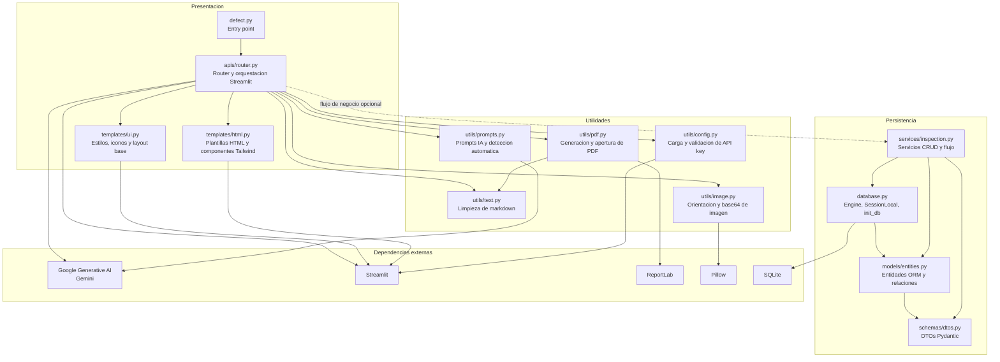
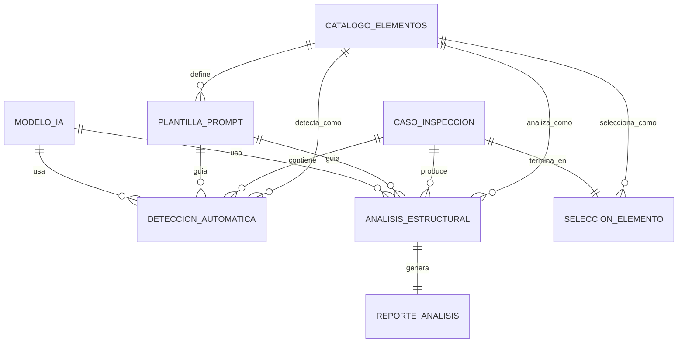
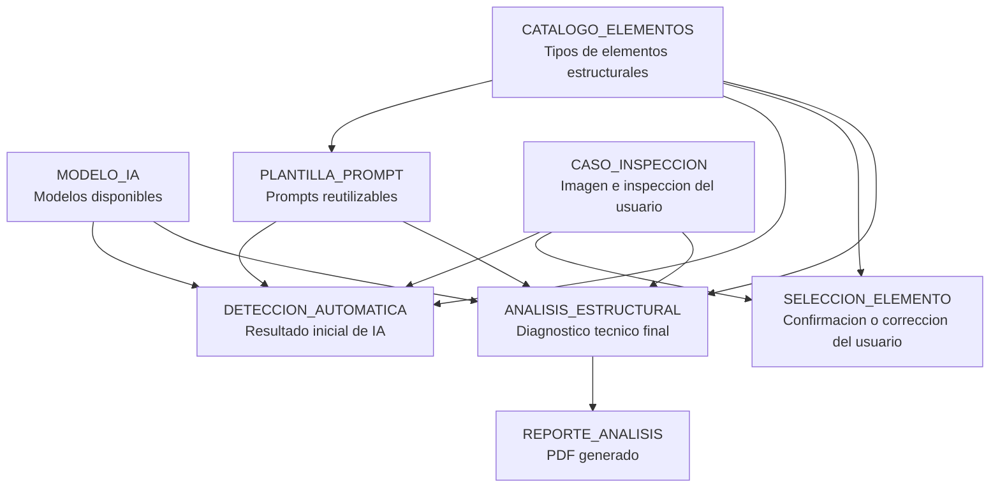
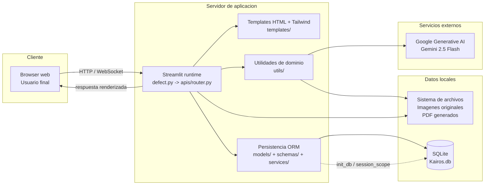

# Kairos

Kairos es una aplicacion de analisis inteligente de defectos estructurales. La interfaz se ejecuta con Streamlit y la arquitectura actual ya esta dividida en capas: un punto de entrada ligero, un router de interfaz, plantillas HTML/Tailwind, utilidades reutilizables y una capa de persistencia con SQLAlchemy + SQLite.

## Arquitectura actual

El siguiente diagrama resume como se distribuyen los componentes en la aplicacion actual.

## Diseno de base de datos

Este modelo captura el flujo real de trabajo: caso de inspeccion, deteccion automatica, seleccion final, analisis estructural y reporte.

## Despliegue

El despliegue representa la ejecucion local o administrada de Streamlit, con Gemini como servicio externo y SQLite como almacenamiento local de metadatos.

## Modulos principales

- [defect.py](defect.py) funciona como punto de entrada.
- [apis/router.py](apis/router.py) concentra el flujo de la interfaz y la orquestacion de la app.
- [templates/ui.py](templates/ui.py) define estilos, iconos y layout base.
- [templates/html.py](templates/html.py) contiene componentes HTML con Tailwind para la capa visual.
- [utils/](utils) agrupa configuracion, imagen, texto, prompts y PDF.
- [database.py](database.py), [models/entities.py](models/entities.py), [schemas/dtos.py](schemas/dtos.py) y [services/inspection.py](services/inspection.py) forman la capa de persistencia.

## Dependencias

Las dependencias principales del proyecto viven en [requirements.txt](requirements.txt): Streamlit, Google Generative AI, Pillow, ReportLab y SQLAlchemy, entre otras.

## Documentacion relacionada

- [diagrama de componentes](diagrama_componentes_kairos.md)
- [diseno de base de datos](diseno_bd_sqlite_kairos.md)
- [diagrama de despliegue](diagrama_despliegue_kairos.md)

## Funcion general

La aplicacion permite cargar una imagen, detectar automaticamente el elemento estructural, confirmar o corregir esa deteccion, ejecutar un analisis especializado y generar un reporte PDF con los resultados.
